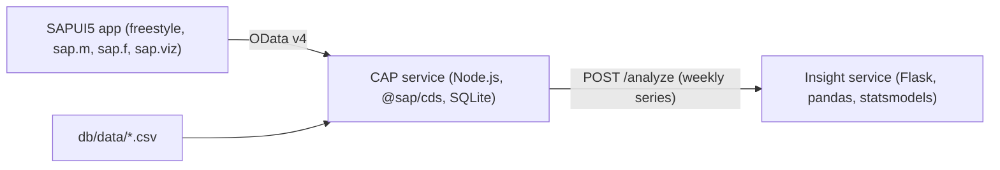

# sap-sales-insights-cap

A small sales analytics app in the style of an SAP project: an **SAP CAP** service that exposes **OData v4**, a **SAPUI5** dashboard on top of it, and a **Python AI service** that finds unusual weeks and forecasts the next four weeks.

The data is synthetic (1183 orders, five materials, five regions, Oct 2025 to Sep 2026, fixed seed), with a few planted spikes and one outage week so the anomaly detection has something real to find.

## Architecture



- `db/` CDS data model (`Materials`, `Orders`), seed CSVs and the script that generates them.
- `srv/` the `SalesService`: entities `Materials`, `Orders`, `MonthlyRevenue` and functions `kpis`, `weekly`, `insights`.
- `app/webapp/` SAPUI5 app: KPI tiles, revenue chart with forecast, anomaly table, filterable orders table.
- `ml/` the Python service (`insights.py` is the model, `app.py` the HTTP wrapper).
- `test/` Node tests for the service, `ml/tests/` pytest tests for the model and API.

## Run it

Needs Node 22 and Python 3.10+.

```bash
# 1. insight service
pip install -r ml/requirements.txt
cd ml && python app.py            # http://localhost:5001

# 2. CAP service + UI (second terminal)
npm install
npm start                         # http://localhost:4004
```

Open http://localhost:4004/webapp/index.html. The UI loads the SAPUI5 runtime from ui5.sap.com, so it needs internet access.

With Docker:

```bash
docker compose up --build
```

Regenerate the sample data with `npm run seed`.

## API examples

```bash
curl "http://localhost:4004/odata/v4/sales/kpis()"
curl "http://localhost:4004/odata/v4/sales/kpis(region='DE')"
curl "http://localhost:4004/odata/v4/sales/weekly(material='M-100')"
curl "http://localhost:4004/odata/v4/sales/insights()"
curl "http://localhost:4004/odata/v4/sales/Orders?\$filter=region eq 'NL'&\$top=5"
```

`kpis(region, material)` returns revenue, orders, units, average order value, revenue of the last 30 days and the growth against the 30 days before.

## How the insights work

1. The service builds a weekly revenue series and drops the incomplete first and last week. Partial weeks look like fake drops.
2. A rolling median gives the expected value for each week. The residual is scored with a robust z-score based on the median absolute deviation (MAD). Weeks scoring above 3.5 are reported as `spike` or `drop`.
3. Anomalies are removed from the series before forecasting, so one outage does not drag the forecast down.
4. A Holt (double exponential smoothing) model forecasts the next four weeks.

On the sample data it finds spikes in weeks 2025-12-01, 2026-02-16 and 2026-03-16 and the outage in week 2026-06-15.

## Tests

```bash
npm test                    # 8 service tests (node --test, stub insight server)
python -m pytest ml/tests   # 5 model and API tests
```

CI (GitHub Actions) runs both on every push.

## Limits

- Data is generated, not from a real SAP system. The model would map onto a BW/4HANA query or a CDS view with the same two fields (week, revenue).
- SQLite runs in memory, so data resets on restart. On SAP BTP you would bind HANA Cloud instead.
- The forecast is a simple statistical baseline. It has no promotions, holidays or price effects.
- The Dockerfiles are written for the layout above, but I have not built them in this environment.
